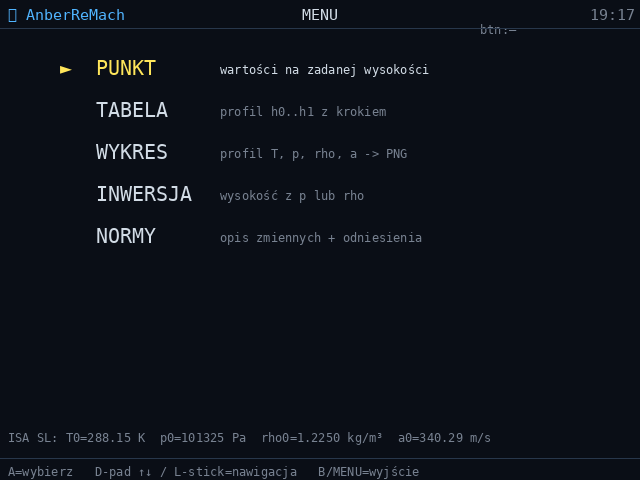
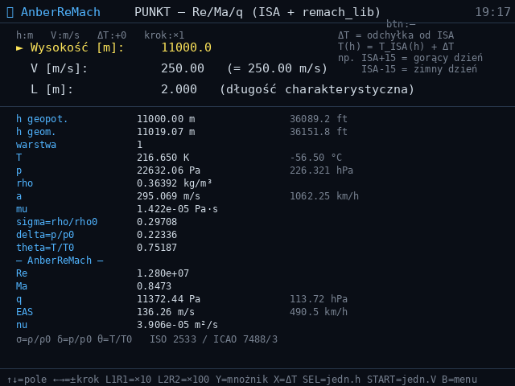
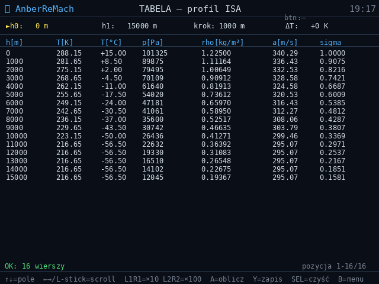

# AnberReMach — liczby podobieństwa (Re, Ma, q, EAS) na Anbernic RG40XX V

[](https://github.com/karolfurtak/AnberReMach/actions/workflows/ci.yml)

Kalkulator **liczb podobieństwa przepływu** dla warunków atmosfery wzorcowej ISA:

- **`remach_lib`** — importowalna biblioteka Pythona (czysty stdlib): Reynolds,
  Mach, ciśnienie dynamiczne, prędkość równoważna + inwersje analityczne
  i numeryczne,
- **`main.py`** — interaktywna aplikacja SDL2 na handheld **Anbernic RG40XX V**
  (640×480, sterowanie padem),
- **`isa_lib`** — zbundlowana biblioteka atmosfery ISA (patrz projekt
  [AnberISA](https://github.com/karolfurtak/AnberISA)), z której `remach_lib`
  bierze ρ, a, μ, ν na zadanej wysokości.

## Zrzuty ekranu

Rzeczywisty interfejs aplikacji na konsoli (640×480, orientacja pozioma). Klatki
uchwycone pikselowo tożsame z ekranem: aplikacja renderuje obraz przez Pillow do
bufora w pamięci, zanim odda go do SDL2 — zrzut zapisuje ten bufor.

| Menu | Punkt — Re / Ma / q / EAS |
| --- | --- |
|  |  |

Ekran **PUNKT** dla przelotu na h = 11 000 m (tropopauza, T = 216,65 K), V_TAS =
250 m/s, L = 2,0 m: Ma = 0,847, Re = 1,28·10⁷, q = 11 372 Pa, EAS = 136,3 m/s.



Ekran **TABELA** — profil atmosfery wzorcowej ISA (T, p, ρ, a, σ) w funkcji
wysokości; tu 0 – 15 000 m co 1000 m.

## Fizyka

Dla zadanych: prędkości rzeczywistej `V` (TAS), wymiaru charakterystycznego `L`,
wysokości geopotencjalnej `h` i odchyłki `ΔT` od ISA:

- **liczba Reynoldsa** `Re = V·L/ν`, gdzie `ν = μ/ρ` z modelu ISA
  (μ z formuły Sutherlanda),
- **liczba Macha** `Ma = V/a`, `a = √(γRT)`,
- **ciśnienie dynamiczne** `q = ½·ρ·V²`,
- **prędkość równoważna** `EAS = V_TAS·√(ρ/ρ₀)` (σ = ρ/ρ₀).

Inwersje:
- analityczne: `V = Re·ν/L`, `V = Ma·a`, `L = Re·ν/V`,
- numeryczna: `h_for_reynolds()` — **bisekcja** wysokości, na której
  `Re(V, L, h, ΔT) = Re_target` (Re maleje monotonicznie z h; tolerancja
  względna, kontrola zakresu osiągalności).

Zakres modelu atmosfery: 0 – 84 852 m geopotencjalnie (≈ 86 km geometrycznie).

## Funkcje aplikacji na konsoli

Ekrany MENU → PUNKT / TABELA / WYKRES / INWERSJA / NORMY (SDL2 + evdev):
- obliczenia punktowe Re/Ma/q/EAS z krokiem o mnożnikach ×0.1 … ×100 000
  (L1/R1 ×10, L2/R2 ×100, Y — cykl mnożnika),
- jednostki prędkości: m/s, km/h, kt, mph, ft/s (START); wysokości: m/ft/km (SELECT),
- odchyłka ΔT od ISA (X),
- tabele z zapisem CSV, wykresy na ekranie konsoli, inwersje,
- diagnostyka kodów evdev w rogu ekranu (dopasowanie przycisków egzemplarza).

## Biblioteka `remach_lib`

```python
from remach_lib import point, v_for_mach, v_for_reynolds, h_for_reynolds

p = point(V=200.0, L=1.0, h_geo=11000)   # pełny zestaw parametrów
print(p["Re"], p["Ma"], p["q_Pa"], p["EAS"])

V = v_for_mach(0.8, h_geo=11000)          # V dla zadanego Ma
V = v_for_reynolds(5e6, L=1.0, h_geo=0)   # V dla zadanego Re
h = h_for_reynolds(5e6, V=200.0, L=1.0)   # h dla zadanego Re (bisekcja)
```

## Struktura

```
remach_lib/           # biblioteka Re/Ma/q/EAS (czysty stdlib)
├── __init__.py       # publiczne API
└── core.py           # point(), inwersje, bisekcja h_for_reynolds()
isa_lib/              # zbundlowana atmosfera ISA (źródło: AnberISA)
main.py               # aplikacja SDL2 na RG40XX V
power_screen.py       # obsługa przycisku POWER / wygaszania ekranu
tests/test_core.py    # testy pytest remach_lib
```

## Uruchomienie

**Na konsoli (Anbernic RG40XX V, stock firmware z Pythonem 3):** skopiuj katalog
do `/mnt/mmc/Roms/APPS/anberremach/` i odpal z menu aplikacji. Wymaga `pysdl2`
(SDL2 w `/usr/lib`), `Pillow`, opcjonalnie `matplotlib` (ekran WYKRES)
i fontu DejaVu Sans Mono.

**Na PC (biblioteka):** czysty Python ≥ 3.10, bez zależności.

## Testy

```bash
python3 -m pytest tests/ -v
# 4 passed
```

Pokrycie: definicje Re/Ma/q/EAS względem wartości referencyjnych ISA oraz
round-trip inwersji (w tym bisekcja wysokości). CI (GitHub Actions, badge
powyżej) uruchamia zestaw na Pythonie 3.11.
